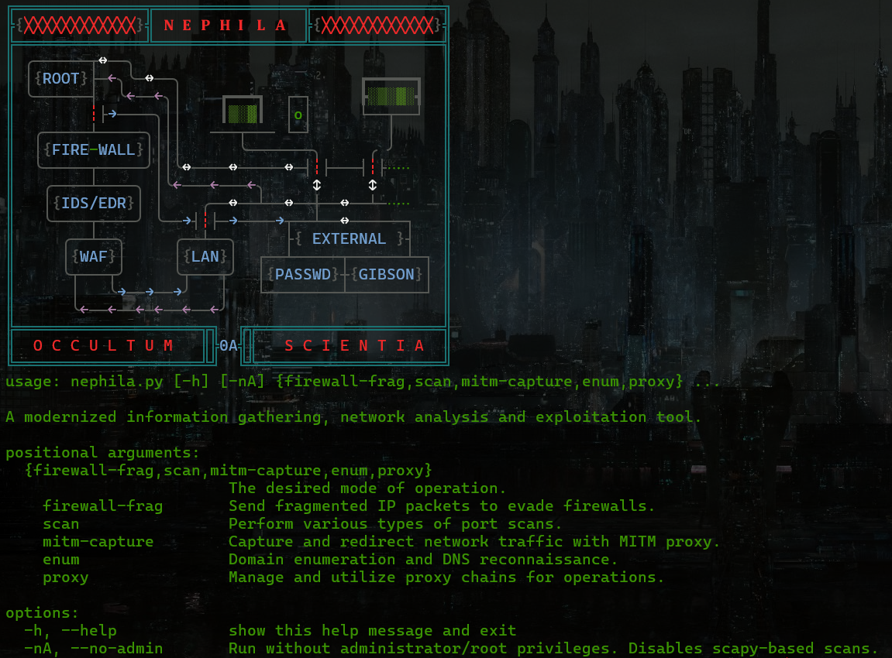

## About

<p align="center">
"𝔗𝔥𝔢 𝔠𝔬𝔯𝔢 𝔞𝔯𝔰𝔢𝔫𝔞𝔩, 𝔢𝔪𝔟𝔬𝔡𝔶𝔦𝔫𝔤 𝔱𝔥𝔢 𝔢𝔰𝔰𝔢𝔫𝔠𝔢 𝔬𝔣 𝔠𝔞𝔩𝔠𝔲𝔩𝔞𝔱𝔢𝔡 𝔪𝔞𝔩𝔢𝔳𝔬𝔩𝔢𝔫ce; 𝔞 𝔠𝔬𝔫𝔳𝔢𝔯𝔤𝔢𝔫𝔠𝔢 𝔬𝔣 𝔡𝔞𝔯𝔨 𝔭𝔯𝔢𝔠𝔦𝔰𝔦𝔬𝔫 𝔞𝔫𝔡 𝔠𝔬𝔫𝔱𝔯𝔬𝔩 𝔥𝔬𝔲𝔰𝔦𝔫𝔤 𝔱𝔬𝔬𝔩𝔰 𝔬𝔣 𝔡𝔦𝔤𝔦𝔱𝔞𝔩 𝔰𝔲𝔟𝔳𝔢𝔯𝔰𝔦𝔬𝔫, 𝔣𝔯𝔬𝔪 𝔫𝔢𝔱𝔴𝔬𝔯𝔨 𝔪𝔞𝔫𝔦𝔭𝔲𝔩𝔞𝔱𝔦𝔬𝔫 𝔱𝔬 𝔢𝔵𝔭𝔩𝔬𝔦𝔱𝔞𝔱𝔦𝔬𝔫 𝔞𝔫𝔡 𝔟𝔢𝔶𝔬𝔫𝔡 — 𝔱𝔥𝔢 𝔥𝔢𝔞𝔯𝔱 𝔬𝔣 𝔶𝔬𝔲𝔯 𝔰𝔢𝔠𝔲𝔯𝔦𝔱𝔶 𝔡𝔬𝔪𝔦𝔫𝔦𝔬𝔫."
</p>
<p align="center">
  
</p>

---

## Global Index

- [Nephila](#nephila)
    - [About Nephila](#about-nehphila)
    - [Notices](#nephila-notices)
    - [Usage](#nephila-usage)


## Setup & Installation

1.  **Clone the repository:**
    ```sh
    git clone https://github.com/J4ck3LSyN-Gen2/Malum.git
    cd malum
    ```

2.  **Create a virtual environment (recommended):**
    ```sh
    python3 -m venv malumEnviron
    source manumEnviron/bin/activate
    # On Windows(powershell), use:  .\malumEnviron\Scripts\Activate.ps1
    ```

3.  **Install dependencies:**
    A `requirements.txt` file should be created containing the following:
    ```
    colorama
    httpx
    scapy
    dnspython
    alive-progress
    ```
    Install them using pip:
    ```sh
    python3 -m pip install -r requirements.txt
    ```

4. **Deactivation:**

    ```sh
    deactivate malumEnviron
    ```
---

## Nephila

### About Nehphila

<p align="center">
  "𝔗𝔥𝔢 𝔴𝔢𝔞𝔳𝔢𝔯 𝔬𝔣 𝔴𝔢𝔟𝔰, 𝔪𝔞𝔰𝔱𝔢𝔯 𝔬𝔣 𝔫𝔢𝔱𝔴𝔬𝔯k𝔰 𝔞𝔫𝔡 𝔲𝔫𝔰𝔢𝔢𝔫 𝔠𝔬𝔫𝔫𝔢𝔠𝔱𝔦𝔬𝔫𝔰; 𝔞 𝔰𝔢𝔫𝔱𝔦𝔫𝔢𝔩 𝔬𝔣 𝔞𝔫𝔞𝔩𝔶𝔰𝔦𝔰 𝔞𝔫𝔡 𝔭𝔯𝔬x79 𝔪𝔞𝔫𝔦𝔭𝔲𝔩𝔞𝔱𝔦𝔬𝔫 𝔱𝔥𝔞𝔱 𝔰𝔭𝔦𝔫𝔰 𝔦𝔫𝔱𝔢𝔩𝔩𝔦𝔤𝔢𝔫𝔠𝔢 𝔣𝔯𝔬𝔪 𝔱𝔥𝔢 𝔱𝔥𝔯𝔢𝔞𝔡𝔰 𝔬𝔣 𝔱𝔯𝔞𝔣𝔣𝔦𝔠 𝔞𝔫𝔡 𝔡𝔞𝔱𝔞 𝔣𝔩𝔬𝔴, 𝔯𝔢𝔳𝔢𝔞𝔩𝔦𝔫𝔤 𝔴𝔥𝔞𝔱 𝔩𝔲𝔯𝔨𝔰 𝔴𝔦𝔱𝔥𝔦n 𝔱𝔥𝔢 𝔫𝔢𝔱’𝔰 𝔡𝔢𝔰𝔦𝔤𝔫."
</p>


<p align="center">
  
</p>

---

**Nephila** is a modernized, multi-faceted tool designed for information gathering, network analysis, and security operations. It provides a suite of modules for tasks ranging from proxy management and port scanning to sophisticated firewall evasion and man-in-the-middle traffic capture. This tool is built to be an executable CLI or can be used pythonically.

---

### Nephilas Core Features

*   **Advanced Proxy Manager (`proxify`)**: Fetch, verify, score, and manage pools of HTTP, HTTPS, SOCKS4, and SOCKS5 proxies. Includes features like round-robin rotation, latency filtering, and health checks.
*   **Firewall Evasion (`firewallFrag`)**: Craft and send fragmented IP packets with randomized payloads and timing to test and bypass firewall and IDS/IPS systems.
*   **Port Scanner (`baseScanner`)**: Perform various stealth scans, including SYN, FIN, XMAS, and NULL scans, as well as standard TCP connect scans with decoy support.
*   **DNS Enumeration (`enumeration`)**: Conduct DNS reconnaissance, including A, MX, NS, and TXT lookups, reverse DNS queries, zone transfers, and subdomain enumeration.
*   **MITM Traffic Capture (`mitmCapture`)**: Capture network traffic on a specified interface, apply BPF filters, and dynamically redirect packets based on user-defined rules.

---

## Nephila Index
- [About Nephila](#about-nehphila)
  - [Core Features](#nephilas-core-features)
- [Credits](#credits)
- [Notices](#nephila-notices)
- [Setup & Installation](#setup--installation)
- [Usage](#nephila-usage)
  - [Command-Line Interface (CLI)](#nephila-command-line-interface-cli)
    - [Proxy Manager (`proxy`)](#nephila-proxy-manager)
    - [Port Scanner (`scan`)](#nephila-port-scanner)
    - [Firewall Evasive Packet Fragmentation (`firewall-frag`)](#nephila-firewall-fragmentation)
    - [DNS Enumeration](#nephila-dns-enumeration)
    - [MITM Capture](#nephila-mitm-capture)
  - [Python Library](#nephila-as-a-python-library)
    - [Proxy Manager (`proxify`)](#nephila-proxy-manager-pythonic)
    - [Port Scanner (`baseScanner`)](#nephila-port-scanner-pythonic)
    - [Firewall Evasive Packet Fragmentation (`firewallFrag`)](#nephilas-send-fragmented-packet-funcitonality-pythonic)
---

## Nephila Notices

*  **Root/Administrator Privileges**: Many of Nephila's features, particularly those involving raw packet crafting and network sniffing (like `scan`, `firewall-frag`, and `mitm-capture`), require root or administrator privileges to function. The script will raise a `PermissionError` if you attempt to use these features without sufficient privileges. You can run the tool with the `--no-admin` flag to disable these features and avoid permission errors.
*  **Ethical Use**: This tool is intended for educational purposes and authorized security testing only. Unauthorized scanning or network interception is illegal. The user is responsible for their actions.
*  **Dependencies**: The script depends on several third-party libraries, including `scapy` for packet manipulation and `dnspython` for DNS queries. The script will attempt to prompt for installation if `scapy` is missing. It is recommended to install all dependencies from `requirements.txt`.

---

## Nephila Usage

Nephila can be run directly from the command line or imported as a module into your own Python scripts.

### Nephila Command-Line Interface (CLI)

The primary way to use Nephila is through its command-line interface. The general syntax is:

```sh
python3 nephila.py [mode] [options]
```

You can get help for any mode by using the `-h` flag:

```sh
python3 nephila.py <mode> -h
```

#### Nephila Proxy Manager

The `proxy` mode allows you to manage and utilize a pool of proxies.

**Actions:**
*   `fetch`: Fetch and verify new proxies from public sources.
*   `list`: List all currently stored proxies.
*   `health`: Perform a health check on stored proxies.
*   `stats`: Get statistics about the proxy pool.
*   `get`: Get a single proxy based on a selection strategy.
*   `export`: Export proxies to a file.
*   `import`: Import proxies from a file.
*   `clear`: Clear all stored proxies.

**Example: Fetch 20 HTTP proxies and get the best one.**
```sh
# Fetch and verify proxies
python3 nephila.py proxy -a fetch -t http -l 20 --verbose

# Get the best proxy from the fetched list
python3 nephila.py proxy -a get --strategy best
```

**Example: Import proxies from a file and verify them.**
```sh
python3 nephila.py proxy -a import --file my_proxies.txt --verify
```

#### Nephila Port Scanner 

The `scan` mode performs various types of port scans on a target host. **Requires root/admin privileges** (except for `connect` scan).

**Scan Types:**
*   `syn` (default): TCP SYN scan (stealthy).
*   `connect`: Standard TCP connect scan.
*   `fin`: TCP FIN scan.
*   `xmas`: TCP "XMAS" scan (flags FIN, PSH, URG).
*   `null`: TCP "Null" scan (no flags set).

**Example: Perform a SYN scan on the top 1024 ports of a host.**
```sh
sudo python3 nephila.py scan 192.168.1.1 "1-1024" -s syn -T 150
```

**Example: Perform a connect scan with decoy IPs.**
```sh
python3 nephila.py scan example.com "80,443" -s connect -d 8.8.8.8 1.1.1.1
```

#### Nephila Firewall Fragmentation 

The `firewall-frag` mode sends fragmented IP packets to a target to test firewall rules. **Requires root/admin privileges.**

**Example: Send fragmented packets to a web server on port 80.**
```sh
sudo python3 nephila.py firewall-frag example.com 80 --min-frag-size 8 --max-frag-size 16 --min-delay 0.2 --max-delay 1.0 -v
```

#### Nephila DNS Enumeration 

The `enum` mode performs various DNS reconnaissance tasks.

**Enum Types:**
*   `full-enum` (default): Performs A, MX, NS, TXT, and subdomain lookups.
*   `dns-a`, `dns-mx`, `dns-ns`, `dns-txt`: Query for specific record types.
*   `reverse`: Perform a reverse DNS lookup on an IP.
*   `zone-transfer`: Attempt a DNS zone transfer.
*   `subdomain-enum`: Enumerate subdomains using a wordlist.

**Example: Perform a full enumeration on a domain.**
```sh
python3 nephila.py enum example.com
```

**Example: Attempt a zone transfer using a specific nameserver.**
```sh
python3 nephila.py enum example.com -t zone-transfer --nameserver ns1.example.com
```

**Example: Enumerate subdomains with a custom wordlist.**
```sh
python3 nephila.py enum example.com -t subdomain-enum -w /path/to/subdomains.txt
```

#### Nephila MITM Capture 

The `mitm-capture` mode captures and optionally redirects network traffic. **Requires root/admin privileges.**

**Example: Capture all TCP traffic on interface `eth0` and export to a file.**
```sh
# Press Ctrl+C to stop capturing
sudo python3 nephila.py mitm-capture -i eth0 -f "tcp" --export capture.json
```

**Example: Capture traffic and redirect requests from port 8080 to `example.com:80`.**
```sh
sudo python3 nephila.py mitm-capture -i wlan0 -r 192.168.1.100 8080 example.com 80
```

---

### Nephila as a Python Library

You can import and use Nephila's classes in your own Python scripts for more complex and customized workflows.

```python
import asyncio
from nephila import nephila

# Initialize the main class
n = nephila()
```

#### Nephila Proxy Manager Pythonic

The `proxify` class provides powerful proxy management capabilities.

```python
async def proxy_example():
    # Initialize the proxy manager
    proxy_manager = n.proxify(n)
    # Fetch and verify 20 HTTP proxies
    print("Fetching proxies...")
    verified_proxies = await proxy_manager.fetchAndVerify(limit=20, proxyType='http')
    print(f"Found {len(verified_proxies)} verified proxies.")
    if not verified_proxies:
        return
    # Get the best proxy based on score
    best_proxy_info = proxy_manager.getProxy(proxyType='http', strategy='best')
    if best_proxy_info:
        print(f"Best proxy: {best_proxy_info['proxy']} (Score: {best_proxy_info['score']})")
    # Get a random proxy
    random_proxy = proxy_manager.getRandomProxy()
    print(f"Random proxy: {random_proxy}")
    # Rotate through proxies
    print("Rotating proxies:")
    for _ in range(5):
        print(f"  - {proxy_manager.rotateProxy()}")

if __name__ == "__main__":
    asyncio.run(proxy_example())
```

#### Nepihlas Port Scanner Pythonic

The `baseScanner` class can be used to programmatically run port scans. Remember that this requires root/admin privileges for stealth scans.

```python
# This example requires root/admin privileges

# Initialize the scanner
scanner = n.baseScanner(
    NSI=n,
    host='scanme.nmap.org',
    timeout=1.0,
    scanJitter=0.5
)

# Define ports to scan
ports_to_scan = [22, 80, 443, 8080]

# Run a SYN scan
print(f"Running SYN scan on {scanner.config['host']}...")
open_ports = scanner._scanPorts(ports_to_scan, maxThreads=10)

if open_ports:
    print("Scan results:")
    for port, status in open_ports.items():
        print(f"  Port {port}: {status}")
else:
    print("No open ports found.")

```

#### Nephilas Send Fragmented Packet Funcitonality Pythonic

Use the `firewallFrag` class to send fragmented packets. This also requires root/admin privileges.

```python
# This example requires root/admin privileges

# Initialize the fragmentation module
frag_sender = n.firewallFrag(n)

target_host = 'example.com'
target_port = 80

print(f"Sending fragmented packets to {target_host}:{target_port}...")

try:
    result = frag_sender.scan(
        rHost=target_host,
        rPort=target_port,
        minFragSize=8,
        maxFragSize=16,
        minInterFragDelay=0.5,
        maxInterFragDelay=2.0,
        verbose=True  # Will print details of each fragment
    )
    print(f"Fragmentation scan completed: {result['status']}")
except PermissionError as e:
    print(f"Error: {e}")

```

## Credits


*   **Author**: J4ck3LSyN
*   **Version**: 0.1.0
*   **License**: MIT

---

[Back to the Top](#about-nehphila)
