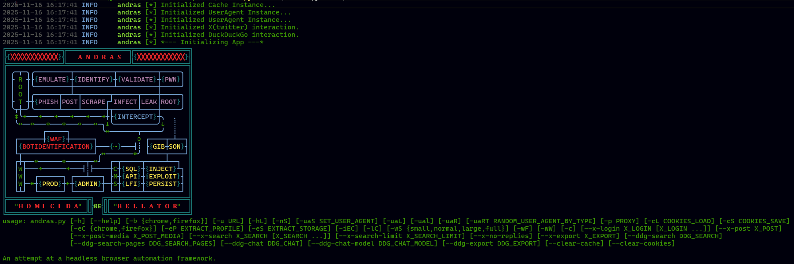
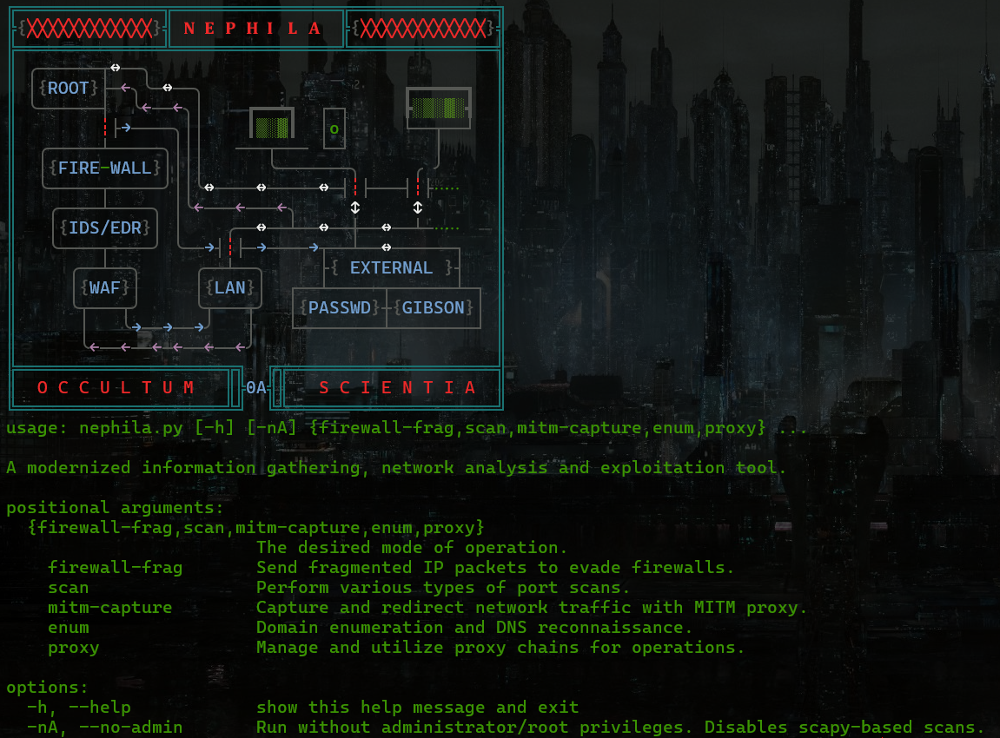
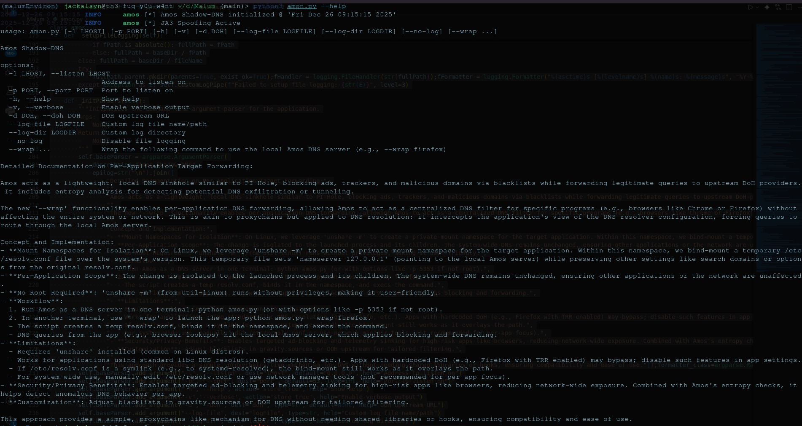

## About

<p align="center">
"𝔗𝔥𝔢 𝔠𝔬𝔯𝔢 𝔞𝔯𝔰𝔢𝔫𝔞𝔩, 𝔢𝔪𝔟𝔬𝔡𝔶𝔦𝔫𝔤 𝔱𝔥𝔢 𝔢𝔰𝔰𝔢𝔫𝔠𝔢 𝔬𝔣 𝔠𝔞𝔩𝔠𝔲𝔩𝔞𝔱𝔢𝔡 𝔪𝔞𝔩𝔢𝔳𝔬𝔩𝔢𝔫ce; 𝔞 𝔠𝔬𝔫𝔳𝔢𝔯𝔤𝔢𝔫𝔠𝔢 𝔬𝔣 𝔡𝔞𝔯𝔨 𝔭𝔯𝔢𝔠𝔦𝔰𝔦𝔬𝔫 𝔞𝔫𝔡 𝔠𝔬𝔫𝔱𝔯𝔬𝔩 𝔥𝔬𝔲𝔰𝔦𝔫𝔤 𝔱𝔬𝔬𝔩𝔰 𝔬𝔣 𝔡𝔦𝔤𝔦𝔱𝔞𝔩 𝔰𝔲𝔟𝔳𝔢𝔯𝔰𝔦𝔬𝔫, 𝔣𝔯𝔬𝔪 𝔫𝔢𝔱𝔴𝔬𝔯𝔨 𝔪𝔞𝔫𝔦𝔭𝔲𝔩𝔞𝔱𝔦𝔬𝔫 𝔱𝔬 𝔢𝔵𝔭𝔩𝔬𝔦𝔱𝔞𝔱𝔦𝔬𝔫 𝔞𝔫𝔡 𝔟𝔢𝔶𝔬𝔫𝔡 — 𝔱𝔥𝔢 𝔥𝔢𝔞𝔯𝔱 𝔬𝔣 𝔶𝔬𝔲𝔯 𝔰𝔢𝔠𝔲𝔯𝔦𝔱𝔶 𝔡𝔬𝔪𝔦𝔫𝔦𝔬𝔫."
</p>
<p align="center">
  
</p>

---

## Global Index
- [Andras](#andras)
    - [About Andras](#about-andras)
    - [Notices](#andras-notices)
    - [Usage](#andras-usage)
- [Nephila](#nephila)
    - [About Nephila](#about-nehphila)
    - [Notices](#nephila-notices)
    - [Usage](#nephila-usage)


## Setup & Installation

1.  **Clone the repository:**
    ```sh
    git clone https://github.com/J4ck3LSyN-Gen2/Malum.git
    cd malum
    ```

2.  **Create a virtual environment (recommended):**
    ```sh
    python3 -m venv malumEnviron
    source manumEnviron/bin/activate
    # On Windows(powershell), use:  .\malumEnviron\Scripts\Activate.ps1
    ```

3.  **Install dependencies:**
    A `requirements.txt` file should be created containing the following:
    ```
    scapy
    fake_useragent
    colorama
    alive_progress
    dnspython
    beautifulSoup4
    urljoin
    selenium
    beautifulsoup4
    requests
    PyYAML
    pycryptodome
    pywin32
    sys_platform == 'win32'
    ```
    Install them using pip:
    ```sh
    python3 -m pip install -r requirements.txt
    ```

4. **Deactivation:**

    ```sh
    deactivate malumEnviron
    ```
---

## Andras

### About Andras

<p align="center">
"𝔗𝔥𝔢 𝔰𝔬𝔴𝔢𝔯 𝔬𝔣 𝔡𝔦𝔰𝔠𝔬𝔯𝔡, 𝔞 𝔭𝔥𝔞𝔫𝔱𝔬𝔪 𝔦𝔫 𝔱𝔥𝔢 𝔪𝔞-𝔠𝔥𝔦𝔫𝔢; 𝔞 𝔪𝔞𝔰𝔱𝔢𝔯 𝔬𝔣 𝔪𝔦𝔪𝔦𝔠𝔯𝔶 𝔞𝔫𝔡 𝔪𝔦𝔰𝔡𝔦𝔯𝔢𝔠𝔱𝔦𝔬𝔫 𝔱𝔥𝔞𝔱 𝔴𝔦𝔢𝔩𝔡𝔰 𝔢𝔵𝔭𝔩𝔬𝔦𝔱𝔰 𝔩𝔦𝔨𝔢 𝔞 𝔰𝔥𝔞𝔯𝔭𝔢𝔫𝔢𝔡 𝔟l𝔞𝔡𝔢, 𝔪𝔬𝔳𝔦𝔫𝔤 𝔲𝔫𝔰𝔢𝔢𝔫 𝔱𝔬 𝔡𝔦𝔰𝔪𝔞𝔫𝔱𝔩𝔢 𝔡𝔢𝔣𝔢𝔫𝔰𝔢𝔰 𝔞𝔫𝔡 𝔰𝔬𝔴 𝔠𝔥𝔞𝔬𝔰 𝔣𝔯𝔬𝔪 𝔱𝔥𝔢 𝔰𝔥𝔞𝔡𝔬𝔴𝔰."
</p>

<p align="center">
  
</p>

**Andras** is a sophisticated browser automation framework designed for emulation, evasion, and interaction. It leverages Selenium to provide a powerful, scriptable interface for controlling web browsers, complete with features for mimicking human behavior and performing complex actions on modern web applications.

---

### Andras Core Features

*   **Advanced Browser Control**: Programmatically start, stop, and configure browsers (Chrome, Firefox) with support for headless mode, proxies, and custom window sizes.
*   **Human Emulation (`ActHuman`)**: Evade bot detection with built-in methods for human-like typing (with typos), mouse movements, clicking, and scrolling.
*   **Stealth & Evasion**: Features include stealth mode for Chrome to hide automation flags, extensive user-agent management with randomization and remote fetching, and proxy support.
*   **X/Twitter Interaction (`XInteract`)**: A dedicated module to automate X, including secure login (with 2FA support), posting tweets (with media), searching for posts, and exporting rich data to JSON or CSV.
*   **DuckDuckGo Interaction (`DuckInteract`)**: Automate searches on DuckDuckGo and interact with its AI Chat, enabling multi-turn conversations and dork construction.
*   **Interactive Console**: Launch a powerful REPL-style console to control an active browser session in real-time, allowing for dynamic element finding, JavaScript execution, and interaction.
*   **Mouse Event Recording & Playback**: Capture and replay mouse movements, clicks, and other events to replicate user interactions.
*   **Built-in Caching**: A simple yet effective file-based caching system to store and retrieve data like user-agent lists, reducing redundant network requests.

---

### Andras Index

- [About Andras](#about-andras)
  - [Core Features](#andras-core-features)
- [Notces](#andras-notices)
- [Usage](#andras-usage)
  - [Command-Line Interface (CLI)](#andras-command-line-interface-cli)
    - [X/Twitter Interaction](#andras-xtwitter-interaction)
    - [DuckDuckGo Interaction](#andras-duckduckgo-interaction)
    - [DuckDuckGo Pythonic](#andras-duckduckgo-interaction-pythonic)
    - [Interactive Console](#andras-interactive-console)

---

### Andras Notices

*   **Ethical Use**: Andras is a powerful automation tool. It should only be used for legitimate, authorized, and ethical purposes. Automating interactions with websites may violate their Terms of Service. The user is solely responsible for their actions.
*   **Account Safety**: When automating actions on platforms like X/Twitter, be aware that excessive or bot-like behavior can lead to account restrictions or suspension. Use the `ActHuman` features and reasonable delays.
*   **Browser Installation**: Andras requires the target browser (e.g., Chrome, Firefox) and its corresponding WebDriver to be installed on the system.

---

### Andras Usage

Andras can be run as a standalone CLI tool or imported as a library into your own Python projects.

#### Andras Command-Line Interface (CLI)

The CLI provides a quick way to perform common tasks.

```sh
python3 andras.py [options]
```

##### Andras X/Twitter Interaction

```sh
# Log in to X/Twitter (will prompt for password if not provided)
python3 andras.py --x-login <username>

# Search for posts containing "cybersecurity" and export to a JSON file
python3 andras.py --x-search "cybersecurity" "threat intelligence" --x-export results.json

# Post a tweet with a media file
python3 andras.py --x-post "Automated post from Andras" --x-post-media /path/to/image.png
```

##### Andras DuckDuckGo Interaction

```sh
# Search DuckDuckGo for a query
python3 andras.py --ddg-search "what is the solomonic demon andras"

# Interact with DuckDuckGo's AI Chat
python3 andras.py --ddg-chat "Write a python script to list files in a directory"
```

##### Andras Interactive Console

Launch a browser and attach an interactive console to control it live.

```sh
python3 andras.py -u https://google.com -c
```

#### Andras as a Python Library

Import `Andras` to integrate its powerful automation capabilities into your own scripts.

##### Andras Basic Browser Control (Pythonic)

```python
from andras import Andras
import time

# Initialize Andras (this does not start the browser)
ai = Andras()
# Start the browser instance
ai.browserInstance.start(browser='chrome', headless=False)
# Navigate to a URL
ai.browserInstance.navigateTo('https://book.hacktricks.xyz/')
time.sleep(5) # Wait for 5 seconds
# Take a screenshot
ai.browserInstance.screenshot('hacktricks.png')
# Stop the browser
ai.browserInstance.stop()
```

##### Andras X/Twitter Interaction (Pythonic)

```python
from andras import Andras
from getpass import getpass

ai = Andras()

# Start a non-headless browser for login
ai.browserInstance.start(headless=False)

# Login to X
username = "your_x_username"
password = getpass("Enter your X password: ")
ai.xInteractInstance.login(username, password)

# Search for posts
results = ai.xInteractInstance.searchPosts(keywords=["OSINT", "redteam"], maxResults=20)

# Export results
ai.xInteractInstance.exportResults("osint_search.json")

ai.browserInstance.stop()
```

##### Andras DuckDuckGo Interaction (Pythonic)

```python
from andras import Andras

ai = Andras()
ai.browserInstance.start(headless=True) # Can be headless

# Perform a search
search_results = ai.duckInteractInstance.search("powershell amsi bypass", pages=2)
print(f"Found {len(search_results)} search results.")

# Have a conversation with DuckDuckGo AI
prompt = "Explain the difference between a SYN scan and a TCP Connect scan."
response = ai.duckInteractInstance.duckChat(prompt)

if response['success']:
    print("--- AI Response ---")
    print(response['response'])

ai.browserInstance.stop()
```

## Nephila

### About Nehphila

<p align="center">
  "𝔗𝔥𝔢 𝔴𝔢𝔞𝔳𝔢𝔯 𝔬𝔣 𝔴𝔢𝔟𝔰, 𝔪𝔞𝔰𝔱𝔢𝔯 𝔬𝔣 𝔫𝔢𝔱𝔴𝔬𝔯k𝔰 𝔞𝔫𝔡 𝔲𝔫𝔰𝔢𝔢𝔫 𝔠𝔬𝔫𝔫𝔢𝔠𝔱𝔦𝔬𝔫𝔰; 𝔞 𝔰𝔢𝔫𝔱𝔦𝔫𝔢𝔩 𝔬𝔣 𝔞𝔫𝔞𝔩𝔶𝔰𝔦𝔰 𝔞𝔫𝔡 𝔭𝔯𝔬x79 𝔪𝔞𝔫𝔦𝔭𝔲𝔩𝔞𝔱𝔦𝔬𝔫 𝔱𝔥𝔞𝔱 𝔰𝔭𝔦𝔫𝔰 𝔦𝔫𝔱𝔢𝔩𝔩𝔦𝔤𝔢𝔫𝔠𝔢 𝔣𝔯𝔬𝔪 𝔱𝔥𝔢 𝔱𝔥𝔯𝔢𝔞𝔡𝔰 𝔬𝔣 𝔱𝔯𝔞𝔣𝔣𝔦𝔠 𝔞𝔫𝔡 𝔡𝔞𝔱𝔞 𝔣𝔩𝔬𝔴, 𝔯𝔢𝔳𝔢𝔞𝔩𝔦𝔫𝔤 𝔴𝔥𝔞𝔱 𝔩𝔲𝔯𝔨𝔰 𝔴𝔦𝔱𝔥𝔦n 𝔱𝔥𝔢 𝔫𝔢𝔱’𝔰 𝔡𝔢𝔰𝔦𝔤𝔫."
</p>

---

<p align="center">
  
</p>

---

**Nephila** is a modernized, multi-faceted tool designed for information gathering, network analysis, and security operations. It provides a suite of modules for tasks ranging from proxy management and port scanning to sophisticated firewall evasion and man-in-the-middle traffic capture. This tool is built to be an executable CLI or can be used pythonically.

---

### Nephilas Core Features

*   **Advanced Proxy Manager (`proxify`)**: Fetch, verify, score, and manage pools of HTTP, HTTPS, SOCKS4, and SOCKS5 proxies. Includes features like round-robin rotation, latency filtering, and health checks.
*   **Firewall Evasion (`firewallFrag`)**: Craft and send fragmented IP packets with randomized payloads and timing to test and bypass firewall and IDS/IPS systems.
*   **Port Scanner (`baseScanner`)**: Perform various stealth scans, including SYN, FIN, XMAS, and NULL scans, as well as standard TCP connect scans with decoy support.
*   **DNS Enumeration (`enumeration`)**: Conduct DNS reconnaissance, including A, MX, NS, and TXT lookups, reverse DNS queries, zone transfers, and subdomain enumeration.
*   **MITM Traffic Capture (`mitmCapture`)**: Capture network traffic on a specified interface, apply BPF filters, and dynamically redirect packets based on user-defined rules.
*   **Nmap Scanner (`nmap`)**: Run nmap scans on target hosts, providing a comprehensive report of open ports, services, and more.

---

## Nephila Index
- [About Nephila](#about-nehphila)
  - [Core Features](#nephilas-core-features)
- [Credits](#credits)
- [Notices](#nephila-notices)
- [Setup & Installation](#setup--installation)
- [Usage](#nephila-usage)
  - [Command-Line Interface (CLI)](#nephila-command-line-interface-cli)
    - [Proxy Manager (`proxy`)](#nephila-proxy-manager)
    - [Port Scanner (`scan`)](#nephila-port-scanner)
    - [Firewall Evasive Packet Fragmentation (`firewall-frag`)](#nephila-firewall-fragmentation)
    - [DNS Enumeration](#nephila-dns-enumeration)
    - [MITM Capture](#nephila-mitm-capture)
    - [nmap Scanner](#nephila-nmap-scanner)
  - [Python Library](#nephila-as-a-python-library)
    - [Proxy Manager (`proxify`)](#nephila-proxy-manager-pythonic)
    - [Port Scanner (`baseScanner`)](#nephila-port-scanner-pythonic)
    - [Firewall Evasive Packet Fragmentation (`firewallFrag`)](#nephilas-send-fragmented-packet-funcitonality-pythonic)
    - [nmap Scanner](#nephila-nmap-pythonic)
---

## Nephila Notices

*  **Root/Administrator Privileges**: Many of Nephila's features, particularly those involving raw packet crafting and network sniffing (like `scan`, `firewall-frag`, and `mitm-capture`), require root or administrator privileges to function. The script will raise a `PermissionError` if you attempt to use these features without sufficient privileges. You can run the tool with the `--no-admin` flag to disable these features and avoid permission errors.
*  **Ethical Use**: This tool is intended for educational purposes and authorized security testing only. Unauthorized scanning or network interception is illegal. The user is responsible for their actions.
*  **Dependencies**: The script depends on several third-party libraries, including `scapy` for packet manipulation and `dnspython` for DNS queries. The script will attempt to prompt for installation if `scapy` is missing. It is recommended to install all dependencies from `requirements.txt`.

---

## Nephila Usage

Nephila can be run directly from the command line or imported as a module into your own Python scripts.

### Nephila Command-Line Interface (CLI)

The primary way to use Nephila is through its command-line interface. The general syntax is:

```sh
python3 nephila.py [mode] [options]
```

You can get help for any mode by using the `-h` flag:

```sh
python3 nephila.py <mode> -h
```

#### Nephila Proxy Manager

The `proxy` mode allows you to manage and utilize a pool of proxies.

**Actions:**
*   `fetch`: Fetch and verify new proxies from public sources.
*   `list`: List all currently stored proxies.
*   `health`: Perform a health check on stored proxies.
*   `stats`: Get statistics about the proxy pool.
*   `get`: Get a single proxy based on a selection strategy.
*   `export`: Export proxies to a file.
*   `import`: Import proxies from a file.
*   `clear`: Clear all stored proxies.

**Example: Fetch 20 HTTP proxies and get the best one.**
```sh
# Fetch and verify proxies
python3 nephila.py proxy -a fetch -t http -l 20 --verbose

# Get the best proxy from the fetched list
python3 nephila.py proxy -a get --strategy best
```

**Example: Import proxies from a file and verify them.**
```sh
python3 nephila.py proxy -a import --file my_proxies.txt --verify
```

#### Nephila Port Scanner 

The `scan` mode performs various types of port scans on a target host. **Requires root/admin privileges** (except for `connect` scan).

**Scan Types:**
*   `syn` (default): TCP SYN scan (stealthy).
*   `connect`: Standard TCP connect scan.
*   `fin`: TCP FIN scan.
*   `xmas`: TCP "XMAS" scan (flags FIN, PSH, URG).
*   `null`: TCP "Null" scan (no flags set).

**Example: Perform a SYN scan on the top 1024 ports of a host.**
```sh
sudo python3 nephila.py scan 192.168.1.1 "1-1024" -s syn -T 150
```

**Example: Perform a connect scan with decoy IPs.**
```sh
python3 nephila.py scan example.com "80,443" -s connect -d 8.8.8.8 1.1.1.1
```

#### Nephila Firewall Fragmentation 

The `firewall-frag` mode sends fragmented IP packets to a target to test firewall rules. **Requires root/admin privileges.**

**Example: Send fragmented packets to a web server on port 80.**
```sh
sudo python3 nephila.py firewall-frag example.com 80 --min-frag-size 8 --max-frag-size 16 --min-delay 0.2 --max-delay 1.0 -v
```

#### Nephila DNS Enumeration 

The `enum` mode performs various DNS reconnaissance tasks.

**Enum Types:**
*   `full-enum` (default): Performs A, MX, NS, TXT, and subdomain lookups.
*   `dns-a`, `dns-mx`, `dns-ns`, `dns-txt`: Query for specific record types.
*   `reverse`: Perform a reverse DNS lookup on an IP.
*   `zone-transfer`: Attempt a DNS zone transfer.
*   `subdomain-enum`: Enumerate subdomains using a wordlist.

**Example: Perform a full enumeration on a domain.**
```sh
python3 nephila.py enum example.com
```

**Example: Attempt a zone transfer using a specific nameserver.**
```sh
python3 nephila.py enum example.com -t zone-transfer --nameserver ns1.example.com
```

**Example: Enumerate subdomains with a custom wordlist.**
```sh
python3 nephila.py enum example.com -t subdomain-enum -w /path/to/subdomains.txt
```

#### Nephila MITM Capture 

The `mitm-capture` mode captures and optionally redirects network traffic. **Requires root/admin privileges.**

**Example: Capture all TCP traffic on interface `eth0` and export to a file.**
```sh
# Press Ctrl+C to stop capturing
sudo python3 nephila.py mitm-capture -i eth0 -f "tcp" --export capture.json
```

**Example: Capture traffic and redirect requests from port 8080 to `example.com:80`.**
```sh
sudo python3 nephila.py mitm-capture -i wlan0 -r 192.168.1.100 8080 example.com 80
```

---

### Nephila as a Python Library

You can import and use Nephila's classes in your own Python scripts for more complex and customized workflows.

```python
import asyncio
from nephila import nephila

# Initialize the main class
n = nephila()
```

#### Nephila Proxy Manager Pythonic

The `proxify` class provides powerful proxy management capabilities.

```python
async def proxy_example():
    # Initialize the proxy manager
    proxy_manager = n.proxify(n)
    # Fetch and verify 20 HTTP proxies
    print("Fetching proxies...")
    verified_proxies = await proxy_manager.fetchAndVerify(limit=20, proxyType='http')
    print(f"Found {len(verified_proxies)} verified proxies.")
    if not verified_proxies:
        return
    # Get the best proxy based on score
    best_proxy_info = proxy_manager.getProxy(proxyType='http', strategy='best')
    if best_proxy_info:
        print(f"Best proxy: {best_proxy_info['proxy']} (Score: {best_proxy_info['score']})")
    # Get a random proxy
    random_proxy = proxy_manager.getRandomProxy()
    print(f"Random proxy: {random_proxy}")
    # Rotate through proxies
    print("Rotating proxies:")
    for _ in range(5):
        print(f"  - {proxy_manager.rotateProxy()}")

if __name__ == "__main__":
    asyncio.run(proxy_example())
```

#### Nepihlas Port Scanner Pythonic

The `baseScanner` class can be used to programmatically run port scans. Remember that this requires root/admin privileges for stealth scans.

```python
# This example requires root/admin privileges

# Initialize the scanner
scanner = n.baseScanner(
    NSI=n,
    host='scanme.nmap.org',
    timeout=1.0,
    scanJitter=0.5
)

# Define ports to scan
ports_to_scan = [22, 80, 443, 8080]

# Run a SYN scan
print(f"Running SYN scan on {scanner.config['host']}...")
open_ports = scanner._scanPorts(ports_to_scan, maxThreads=10)

if open_ports:
    print("Scan results:")
    for port, status in open_ports.items():
        print(f"  Port {port}: {status}")
else:
    print("No open ports found.")

```

#### Nephilas Send Fragmented Packet Funcitonality Pythonic

Use the `firewallFrag` class to send fragmented packets. This also requires root/admin privileges.

```python
# This example requires root/admin privileges

# Initialize the fragmentation module
frag_sender = n.firewallFrag(n)

target_host = 'example.com'
target_port = 80

print(f"Sending fragmented packets to {target_host}:{target_port}...")

try:
    result = frag_sender.scan(
        rHost=target_host,
        rPort=target_port,
        minFragSize=8,
        maxFragSize=16,
        minInterFragDelay=0.5,
        maxInterFragDelay=2.0,
        verbose=True  # Will print details of each fragment
    )
    print(f"Fragmentation scan completed: {result['status']}")
except PermissionError as e:
    print(f"Error: {e}")

```

### Nephila NMAP Scanner

```sh
usage: nephila.py nmap [-h] [-p PORTS] [-a ARGS] [--su] [-v] [-o] targets

positional arguments:
  targets               Target hosts to scan, comma-separated.

options:
  -h, --help            show this help message and exit
  -p PORTS, --ports PORTS
                        Ports to scan (e.g., '80,443', '1-1000').
  -a ARGS, --args ARGS  Nmap arguments, colon-separated (e.g., 'sV:O:T4').
  --su                  Run nmap with sudo (for OS detection, etc.).
  -v, --verbose         Enable verbose output during scan.
  -o, --output          Write XML output to a file in the 'nmapScanOutput' directory.
```

### Nephila NMAP Pythonic

```python
# This example requires nmap to be installed on your system.
# Initialize the nmap scanner
nmapScanner = n.nmap(n)
# Configure it to write output files
nmapScanner.config['writeFile'] = True
print("Running Nmap scan...")
results = nmapScanner.scan(
    targets="scanme.nmap.org", # Can be [str,...] or seperated via host1,host2,...
    ports="22,80", # Can be [str,...] or seperated via port1,port2,... or ranged via 1-65535
    args="sV:A", # Service version and Aggressive scan options
    su=True, # Use sudo for more scan types (does nothing on windows)
    verbose=True # Verbosity
)
print(f"Nmap scan finished. Found {len(results['scans'][0]['hosts'])} host(s).")
```

## Amon 
<p align="center">

"𝔗𝔥𝔢 𝔰𝔥𝔞𝔡𝔬𝔴 𝔤𝔲𝔞𝔯𝔡𝔦𝔞𝔫 𝔬𝔣 𝔱𝔥𝔢 𝔫𝔢𝔱, 𝔞 𝔰𝔦𝔩𝔢𝔫𝔱 𝔬𝔟𝔰𝔢𝔯𝔳𝔢𝔯 𝔱𝔥𝔞𝔱 𝔣𝔦𝔩𝔱𝔢𝔯𝔰 𝔱𝔥𝔢 𝔣𝔩𝔬𝔴 𝔬𝔣 𝔡𝔞𝔱𝔞; 𝔞 𝔡𝔢𝔣𝔢𝔫𝔡𝔢𝔯 𝔞𝔤𝔞𝔦𝔫𝔰𝔱 𝔪𝔞𝔩𝔦𝔠𝔦𝔬𝔲𝔰 𝔡𝔬𝔪𝔞𝔦𝔫𝔰 𝔞𝔫𝔡 𝔞 𝔴𝔞𝔱𝔠𝔥𝔢𝔯 𝔣𝔬𝔯 𝔰𝔲𝔰𝔭𝔦𝔠𝔦𝔬𝔲𝔰 𝔱𝔯𝔞𝔣𝔣𝔦𝔠, 𝔰𝔦𝔫𝔨𝔦𝔫𝔤 𝔱𝔥𝔢 𝔲𝔫𝔴𝔞𝔫𝔱𝔢𝔡 𝔞𝔫𝔡 𝔭𝔯𝔬𝔱𝔢𝔠𝔱𝔦𝔫𝔤 𝔱𝔥𝔢 𝔦𝔫𝔫𝔬𝔠𝔢𝔫𝔱 𝔣𝔯𝔬𝔪 𝔱𝔥𝔢 𝔰𝔥𝔞𝔡𝔬𝔴𝔰."
</p>

### Amon Usage

Amon is primarily run as a standalone DNS server via CLI, but can also be imported as a library.
<p align="center">
  
</p>

### Amon Core Features

* _AD/Tracker/Malware Blocking_: Uses "gravity" blocklists (fetched from sources like StevenBlack and Hagezi) to sinkhole malicious or unwanted domains to 0.0.0.0.
* _DNS over HTTPS Forwarding_: Securely resolves clean queries via DoH with rotating providers and optional JA3 fingerprint spoofing (via curl_cffi).
* _DNS Tunneling Detection_: Calculates Shannon entropy on domain labels and flags high-entropy or overly long queries as suspicious.
* _Caching_: Simple in-memory cache for repeated queries to reduce upstream requests.
* _Logging_: Colored console logging with optional file logging for monitoring blocked and resolved domains.
* _Threaded Performance_: Handles multiple concurrent DNS requests efficiently.

### Amon Notices

* __Root/Administrator Privileges__: Binding to port 53 requires root privileges. Without it, the script will exit with a permission error.
* __Ethical Use__: Amon is intended for personal network protection, ad-blocking, and defensive security research. Use only on networks you own or have authorization to monitor.
* __Optional Dependency__: JA3 spoofing for better evasion in DoH requests requires curl_cffi.requests. If not installed, it falls back to standard requests.

### Amon Dependencies

```markdown
* dnslib
* curl_cffi
```

### Amon CLI

* `-h, ---help`: Displays the help message.
* `-p, --port <port>`: Listen on a custom port (no root needed if >1024).
* `--doh <url>`: Use a specific DoH upstream (default rotates between Cloudflare/Google/Quad9).
* `--log-dir <path>`: Custom directory for log files.
* `--log-file <file>`: Custom log file name/path.
* `--no-file-log`: Disable file logging.
* `--verbosity`: Control console output verbosity.

## Credits


*   **Author**: J4ck3LSyN
*   **Version**: 0.1.0
*   **License**: MIT

---
[Back to the Top](#about)
